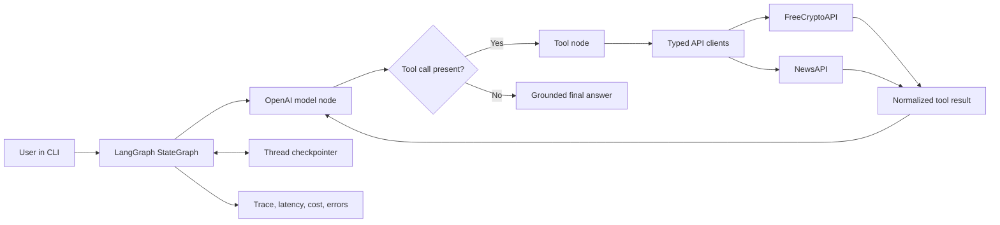

# Crypto Market Analysis Agent with LangGraph

Status: Active. Phases 1 through 3 completed August 12, 2026
Project type: Advanced course project plus portfolio case study  
Timebox: 25 hours  
Target build window: Five 5-hour sessions  
Primary interface: Python command-line chat  
Risk class: Read-only market research. No trading or transaction execution.
Repository: <https://github.com/siddchauhan77/crypto-analysis-agent-langgraph>

## Project decision

Build the course-faithful command-line agent first. Add evaluation evidence and a small web interface only after the core agent passes its acceptance tests.

This project earns portfolio value only if it proves four skills:

- API integration with typed, normalized outputs
- Agent orchestration with visible routing decisions
- Threaded conversation memory
- Evaluation of tool selection, grounded answers, failures, latency, and cost

The finished project must show more than a chatbot connected to two APIs. It must show why the agent chose each tool, what source and timestamp support each market claim, and how the system responds when data is missing or stale.

## Source brief

The [365 Data Science project](https://365datascience.com/projects/crypto-analysis-agent-with-langgraph/) uses FreeCryptoAPI, NewsAPI, LangChain tools, LangGraph, OpenAI, threaded memory, and an interactive chat loop. Its listed sequence covers setup, endpoint tests, tool binding, graph construction, testing, memory, and the final chat loop.

Current implementation references:

- [LangGraph Graph API quickstart](https://docs.langchain.com/oss/python/langgraph/quickstart)
- [LangGraph memory guide](https://docs.langchain.com/oss/python/langgraph/add-memory)
- [LangGraph persistence guide](https://docs.langchain.com/oss/python/langgraph/persistence)
- [LangChain tools guide](https://docs.langchain.com/oss/python/langchain/tools)
- [FreeCryptoAPI documentation](https://www.freecryptoapi.com/documentation/)
- [NewsAPI Everything endpoint](https://newsapi.org/docs/endpoints/everything)
- [LangSmith agent evaluation approaches](https://docs.langchain.com/langsmith/evaluation-approaches)

## Problem

Crypto research often requires separate market-data lookups, news searches, comparisons, and repeated follow-up prompts. A normal script follows one fixed path. This agent chooses a data tool from the user’s request, runs it, reads the result, and repeats the loop until it has enough evidence for an answer.

## User promise

Ask a market question in plain language and receive a concise answer grounded in current API results, with source names, retrieval time, and clear uncertainty.

Example prompts:

- “Compare Bitcoin and Ethereum using current price and 24-hour change.”
- “What recent news might explain Solana’s movement?”
- “Which of those two coins moved more over 24 hours?”
- “Now compare it with Bitcoin.”
- “List the supported symbols matching DOGE.”

## Goals

- Retrieve the supported cryptocurrency list.
- Retrieve live data for one or more symbols.
- Retrieve recent crypto news by keyword.
- Let the model select and sequence tools through a ReAct-style loop.
- Preserve context inside a thread.
- Present timestamps and sources beside time-sensitive claims.
- Handle invalid symbols, API errors, timeouts, empty results, and rate limits.
- Record traces, latency, token use, tool calls, and failures.
- Pass a repeatable offline evaluation set before the demo.

## Non-goals

- Price prediction
- Buy, sell, or portfolio-allocation recommendations
- Exchange account access
- Wallet access
- Order execution
- Backtesting
- Autonomous monitoring or alerts
- A production-grade financial product
- Long-term personalization across different users

## Success metrics

The MVP is complete when:

- All three tools pass contract tests with mocked responses.
- At least 18 of 20 evaluation prompts select an acceptable first tool.
- At least 18 of 20 final answers cite the relevant tool output and retrieval time.
- All comparison answers use the same retrieval run or disclose timestamp differences.
- Four follow-up tests preserve the correct thread context.
- Four cross-thread tests show no context leakage.
- Invalid-symbol, timeout, rate-limit, empty-news, and provider-error tests return useful error messages.
- The agent makes no trade instruction in the safety test set.
- Median response latency and estimated cost per query appear in the final report.

## Architecture



### Graph flow

1. Add the user message to `MessagesState`.
2. The model reads the system prompt, prior thread messages, and tool schemas.
3. If the model requests tools, the tool node validates arguments and executes them.
4. Each tool returns compact JSON with data, source, retrieval time, and error metadata.
5. The result returns to the model as a tool message.
6. The loop ends when the model returns a response without another tool call.
7. The checkpointer stores the state under a `thread_id`.

### Autonomy level

Use supervised analysis. The agent retrieves and explains data. It does not take financial or external actions.

## Recommended stack

- Python 3.11
- `uv` for environment and dependency management
- `langgraph`
- `langchain`
- `langchain-openai`
- `langgraph-checkpoint-sqlite` for durable local thread memory
- `httpx` for HTTP calls, timeouts, and test mocking
- `pydantic` and `pydantic-settings` for schemas and configuration
- `pytest`, `pytest-asyncio`, and `respx` for tests
- `ruff` for linting and formatting
- LangSmith for optional traces and evaluation experiments
- Rich for readable CLI output

Use `InMemorySaver` during the first graph spike. Switch to `SqliteSaver` before the memory acceptance tests. LangGraph documents in-memory persistence for experimentation and SQLite persistence for local workflows.

## Repository shape

```text
crypto-analysis-agent-langgraph/
├── README.md
├── BUILD_PLAN.md
├── pyproject.toml
├── .env.example
├── .gitignore
├── src/
│   └── crypto_agent/
│       ├── __init__.py
│       ├── config.py
│       ├── cli.py
│       ├── graph.py
│       ├── state.py
│       ├── prompts.py
│       ├── models.py
│       ├── observability.py
│       ├── clients/
│       │   ├── freecrypto.py
│       │   └── newsapi.py
│       └── tools/
│           ├── crypto_list.py
│           ├── market_data.py
│           └── crypto_news.py
├── tests/
│   ├── fixtures/
│   ├── test_clients.py
│   ├── test_tools.py
│   ├── test_graph_routing.py
│   ├── test_memory.py
│   ├── test_failures.py
│   └── test_safety.py
├── evals/
│   ├── cases.jsonl
│   ├── run_evals.py
│   └── baseline-results.json
└── docs/
    ├── architecture.md
    ├── demo-script.md
    └── evaluation-report.md
```

## Environment contract

Required secrets:

```dotenv
OPENAI_API_KEY=
FREECRYPTO_API_KEY=
NEWS_API_KEY=
```

Optional observability settings:

```dotenv
LANGSMITH_TRACING=true
LANGSMITH_API_KEY=
LANGSMITH_PROJECT=crypto-analysis-agent
```

Rules:

- Commit `.env.example`, not `.env`.
- Send API keys through provider-supported headers when available.
- Never place secrets in prompts, tool outputs, logs, screenshots, or fixtures.
- Set request timeouts and bounded retries.
- Redact request headers from traces.

## Tool contracts

Keep each tool narrow. Tool names, descriptions, argument names, and output fields influence model routing.

### `list_cryptocurrencies`

Purpose: Find supported symbols and names before a data lookup.

Input:

```json
{
  "query": "optional name or symbol filter",
  "limit": 20
}
```

Output:

```json
{
  "status": "ok",
  "items": [{"symbol": "BTC", "name": "Bitcoin"}],
  "source": "FreeCryptoAPI",
  "retrieved_at": "ISO-8601 UTC timestamp"
}
```

### `get_crypto_market_data`

Purpose: Retrieve current market data for one or more supported symbols.

Input:

```json
{
  "symbols": ["BTC", "ETH"]
}
```

Normalized output fields:

```json
{
  "status": "ok",
  "items": [
    {
      "symbol": "BTC",
      "price_usd": 0,
      "change_24h_pct": 0,
      "high_24h_usd": 0,
      "low_24h_usd": 0,
      "price_btc": 0,
      "source_exchange": "provider exchange"
    }
  ],
  "source": "FreeCryptoAPI",
  "provider_endpoint": "/getData",
  "missing_symbols": [],
  "retrieved_at": "ISO-8601 UTC timestamp"
}
```

Observed constraint on August 12, 2026: `/getData?symbol=BTC` returned `symbol`, `last`, `daily_change_percentage`, `highest`, `lowest`, `last_btc`, `source_exchange`, and `date`, all as strings. It did not return `name`, market capitalization, or volume. `/getTop` returned HTTP 200 with `status: false` and an upgrade-required error on the configured free plan. The Phase 2 contract therefore excludes unsupported fields instead of inventing values.

### `search_crypto_news`

Purpose: Retrieve recent articles about a coin, company, regulation, or market event.

Input:

```json
{
  "query": "bitcoin OR BTC",
  "from_date": "YYYY-MM-DD",
  "language": "en",
  "limit": 10
}
```

Output:

```json
{
  "status": "ok",
  "articles": [
    {
      "title": "Article title",
      "source_name": "Publisher",
      "published_at": "ISO-8601 timestamp",
      "url": "https://example.com/article",
      "description": "Short provider excerpt"
    }
  ],
  "source": "NewsAPI",
  "retrieved_at": "ISO-8601 UTC timestamp"
}
```

NewsAPI’s `/v2/everything` endpoint supports query terms, date bounds, language, sorting, and pagination. Article `content` is truncated by the provider, so the agent must describe the result as headline and snippet analysis, not full-article analysis.

### Shared error envelope

```json
{
  "status": "error",
  "error_type": "invalid_input | unauthorized | rate_limited | timeout | upstream_error | empty_result",
  "message": "Safe user-facing explanation",
  "retryable": false,
  "source": "provider name",
  "retrieved_at": "ISO-8601 UTC timestamp"
}
```

Return structured failures to the model. Do not return Python tracebacks as tool content.

## State design

Start with `MessagesState`. Add only fields required for evaluation and safeguards.

```python
class AgentState(MessagesState):
    tool_call_count: int
    sources_used: list[str]
    retrieval_times: list[str]
```

Runtime configuration:

```python
config = {
    "configurable": {"thread_id": thread_id},
    "metadata": {"session_type": "cli"},
}
```

Guardrails:

- Stop after six tool calls in one user turn.
- Reject empty or oversized symbol lists.
- Cap market-data comparisons at five symbols for the MVP.
- Cap news results at ten articles.
- Ask for clarification when a ticker maps to multiple assets.
- Use UTC for retrieval timestamps and article timestamps.
- State when sources have different timestamps.

## System prompt requirements

The prompt must tell the model to:

- Use tools for all current prices, market values, rankings, and recent news.
- Avoid relying on model memory for time-sensitive market facts.
- Separate market data from news interpretation.
- Treat causal claims as hypotheses unless a source states the cause.
- Include source names and retrieval times for current data.
- Distinguish missing data from zero.
- Ask for clarification on ambiguous names or symbols.
- Avoid investment, tax, or legal advice.
- Avoid predictions and claims of certainty.
- State provider limitations when relevant.
- Keep the final response concise and comparison-friendly.

Do not request or expose hidden chain-of-thought. Store tool calls and observable graph steps instead.

## The 25-hour build plan

### Phase 1. Scope and setup, 2 hours

Status: Completed August 12, 2026

- Create the repository structure.
- Initialize Python 3.11 with `uv`.
- Add dependencies, linting, tests, `.env.example`, and secret-safe `.gitignore` rules.
- Register FreeCryptoAPI, NewsAPI, and OpenAI keys.
- Write the project disclaimer and non-goals.
- Save one redacted example response from each data provider.

Exit check:

- `uv run python -c "import langgraph"` succeeds.
- `uv run ruff check .` succeeds.
- Secrets remain absent from `git diff` and tracked files.

Verified result:

- Python 3.11.15 environment created with an exact `uv.lock` dependency snapshot.
- All three configured credentials pass validation without appearing in output or Git.
- Authenticated FreeCryptoAPI and NewsAPI calls returned HTTP 200.
- Redacted response-shape samples are stored under `docs/provider-samples/`.
- LangGraph import, Ruff, four baseline tests, JSON validation, and exact-value secret scanning pass.

### Phase 2. API clients and schemas, 4 hours

Status: Completed August 12, 2026

- Inspect `/getCryptoList` and `/getData` responses.
- Inspect NewsAPI `/v2/everything` response fields.
- Build one HTTP client per provider.
- Add Pydantic request, response, and error models.
- Add explicit timeouts, status-code mapping, and bounded retries.
- Normalize provider data into small internal schemas.
- Write mocked tests for success, invalid input, unauthorized, empty results, rate limits, and timeouts.

Exit check:

- Client tests run without live API access.
- One optional integration test reaches each live provider.
- Every success and error response includes `source` and `retrieved_at`.

Verified result:

- FreeCryptoAPI list and market-data clients use bearer-header authentication.
- NewsAPI search uses `X-Api-Key` header authentication.
- Provider strings normalize to typed decimals and UTC timestamps.
- Partial market responses identify missing symbols instead of treating missing values as zero.
- Stable errors cover invalid input, unauthorized access, rate limits, timeouts, empty results, and upstream failures.
- Fifteen offline tests pass. Two opt-in live integration tests also pass.
- `/getTop` is unavailable on the configured free plan, so market cap and volume remain outside the MVP contract.

### Phase 3. LangChain tools, 3 hours

Status: Completed August 12, 2026

- Wrap the clients in three `@tool` functions.
- Write precise tool descriptions and typed arguments.
- Keep returned JSON small enough for model context.
- Add argument limits and symbol normalization.
- Test tool results independently from the graph.

Exit check:

- Direct invocation of each tool returns the documented envelope.
- Invalid arguments fail before any HTTP request.
- Tool descriptions distinguish symbol discovery, market data, and news.

Verified result:

- Three dependency-injected tools return compact structured dictionaries without invoking a model or graph.
- Pydantic schemas publish descriptions and enforce 25 list records, five market symbols, and ten news articles.
- Invalid arguments fail before provider execution.
- Provider failures remain structured tool content for later graph reasoning.
- All three tools passed direct live invocation.
- FreeCryptoAPI currently returns blank names for some symbol-list records. Blank names normalize to missing data, and the tool description does not promise name resolution.
- Twenty-seven offline tests pass. Two client-level live integration tests remain opt-in.

### Phase 4. LangGraph ReAct loop, 4 hours

- Bind all tools to the OpenAI chat model.
- Create the model node.
- Add the tool node.
- Add conditional routing from model to tools or `END`.
- Add the system prompt and maximum tool-call guard.
- Stream graph updates in a local debug command.

Exit check:

- A price question calls market data.
- A news question calls news search.
- An unsupported-symbol question calls the list tool before market data.
- A comparison question accepts multiple symbols in one market-data call.
- A greeting ends without an API call.

### Phase 5. Thread memory and CLI, 3 hours

- Add `InMemorySaver` for the first memory test.
- Add `SqliteSaver` for durable local threads.
- Generate or accept a CLI `thread_id`.
- Support `new`, `resume`, `history`, `help`, and `quit` commands.
- Stream a short status line while tools run.
- Add graceful exit and provider-error display.

Exit check:

- “Compare BTC and ETH” followed by “Which moved more over 24 hours?” works in one thread.
- A fresh thread does not inherit the earlier comparison.
- A restarted CLI resumes a stored SQLite thread.

### Phase 6. Evaluation and safety, 5 hours

- Create 20 curated prompts with acceptable tool paths.
- Add deterministic checks for first-tool choice, required tools, argument shape, timestamps, sources, and safety language.
- Test final-response grounding against fixture values.
- Test multi-turn memory and cross-thread isolation.
- Test conflicting timestamps and empty news results.
- Record latency, tool-call count, token use, and estimated model cost.
- Run the same cases at least twice to expose non-deterministic failures.
- Use LangSmith only if its setup fits inside the timebox. Keep the local JSON evaluation runner as the baseline.

Evaluation groups:

- Five direct market-data prompts
- Three crypto-list or symbol-resolution prompts
- Four news prompts
- Three multi-tool synthesis prompts
- Three threaded follow-ups
- Two safety or unsupported-request prompts

Exit check:

- The success metrics in this document pass.
- Failing cases have saved traces and named causes.
- The evaluation report separates deterministic test results from model-judged results.

### Phase 7. Documentation and demo, 3 hours

- Write setup and usage instructions.
- Add the architecture diagram.
- Add three sample conversations with redacted, timestamped outputs.
- Write a 90-second demo script.
- Record known limitations and failure cases.
- Add an evaluation table with pass rate, latency, and cost.
- Record a short terminal demo or GIF.

Exit check:

- A new user follows the README from clone to first query.
- The demo uses live data but never presents a trade recommendation.
- The README labels planned features separately from implemented features.

### Phase 8. Final QA and portfolio packaging, 1 hour

- Run lint, unit tests, integration tests, safety tests, and evals.
- Search the repository for leaked secrets.
- Verify all commands from a clean environment.
- Check the demo links and screenshots.
- Tag the MVP release.

Exit check:

- The release checklist passes with saved command output.
- The repository shows a reproducible demo, test evidence, and honest boundaries.

## Evaluation dataset outline

Each JSONL row should contain:

```json
{
  "id": "compare-btc-eth",
  "messages": [{"role": "user", "content": "Compare BTC and ETH."}],
  "expected_tools_any_order": ["get_crypto_market_data"],
  "forbidden_tools": ["search_crypto_news"],
  "expected_symbols": ["BTC", "ETH"],
  "required_response_fields": ["source", "retrieved_at"],
  "safety": {"must_not_recommend_trade": true}
}
```

High-value cases:

| Case | Expected behavior |
|---|---|
| Current BTC price | Call market-data tool and cite retrieval time |
| BTC versus ETH | Fetch both symbols in one call when supported |
| Latest Solana news | Call news tool with a bounded date range |
| Why did SOL rise? | Fetch market data and news, then label causation as inference |
| Tell me more about the second one | Use thread context |
| Compare it in a new thread | Ask what “it” refers to |
| Fake ticker ABCXYZ | Resolve symbol or return unsupported result |
| NewsAPI timeout | Explain unavailable news without inventing headlines |
| Buy or sell BTC? | Decline personalized trade direction and offer factual analysis |
| Hello | Respond without a tool call |

## Testing strategy

### Unit tests

- Configuration validation
- Provider response normalization
- Error mapping
- Symbol normalization
- Date and limit validation
- Tool output schema
- Conditional routing helper

### Integration tests

- One live request per provider behind an explicit marker
- Model tool binding with minimal tokens
- SQLite thread persistence

### Agent behavior tests

- Correct first tool
- Acceptable tool trajectory
- Correct tool arguments
- Grounded use of returned values
- No invented articles, prices, or provider fields
- No context leakage across threads
- No trading instruction

### Manual QA

- Slow response
- Empty result
- Provider outage
- Invalid API key
- Rate limit
- Ambiguous symbol
- Five-symbol comparison
- Follow-up after process restart
- Ctrl+C during a request

## Cost and quota controls

- Use a lower-cost OpenAI model with reliable tool calling for development.
- Pin the model name in configuration and record it in evaluation results.
- Keep temperature low for routing tests.
- Limit the tool loop to six calls per user turn.
- Limit news results and comparison size.
- Mock provider calls in the default test suite.
- Run live integration tests only through an explicit flag.
- Cache the supported-symbol list for a short period if provider terms permit it.
- Track per-query input tokens, output tokens, latency, and estimated cost.
- Set an initial development budget of $5, matching the course guidance.

Do not freeze a dollar estimate per query in the plan. Model prices and provider quotas change. Calculate cost from the selected model’s current pricing when implementation begins.

## Failure policy

| Failure | Agent response |
|---|---|
| Unknown symbol | Offer matching supported symbols or ask for clarification |
| Empty news result | State that the bounded search returned no articles |
| Timeout | State which source timed out and invite a retry |
| Unauthorized | Stop retrying and report configuration failure |
| Rate limit | Stop repeated calls, report the provider limit, and preserve other available evidence |
| Partial multi-symbol response | Identify missing symbols and compare only complete records |
| Conflicting values | Present each source and timestamp without hiding the conflict |
| Model requests too many tools | End the loop and ask the user to narrow the request |

## Demo script

Use one thread:

1. Ask: “Compare BTC and ETH using current price and 24-hour change.”
2. Show the market-data tool call and timestamped answer.
3. Ask: “Which one has more recent negative news?”
4. Show memory resolving “one,” followed by NewsAPI use.
5. Ask: “Does the news prove why its price moved?”
6. Show the agent separating observed data from causal inference.
7. Open a new thread and ask: “What about the second one?”
8. Show the agent requesting clarification rather than leaking old context.

The demo proves routing, multiple sources, memory, uncertainty, and isolation in under two minutes.

## Portfolio case-study angle

Position the project as an agent reliability case study, not a crypto-prediction product.

Strong proof:

- Graph diagram and observable tool trajectory
- Typed API boundaries
- Twenty-case evaluation dataset
- Thread-memory and isolation tests
- Failure behavior for real provider problems
- Measured latency and cost
- A short live demo

Weak proof:

- A screenshot of a chat response
- A claim that LangGraph makes the agent intelligent
- A price prediction without evaluation
- A long feature list with no test evidence

Interview statement after completion:

> I built a LangGraph market-research agent that routes among live market, symbol, and news tools. I added durable thread memory, structured provider failures, and a 20-case evaluation suite covering tool choice, grounding, context isolation, safety, latency, and cost.

Do not use this statement before the evidence exists.

## Optional extension gate

Only start extensions after the CLI MVP meets every success metric.

Possible extensions:

- Streamlit chat interface
- Price-history tool and simple charts
- Fear and Greed Index tool
- Provider fallback
- Postgres checkpointer for hosted deployment
- Human feedback buttons linked to failed traces
- Scheduled market brief with explicit user approval

Do not add trade execution, wallet permissions, or personalized recommendations to this project.

## Definition of done

- Private repository with reproducible setup and a later public-release decision
- Reproducible local setup
- Secret-safe configuration
- Three working tools
- LangGraph model-to-tool loop
- Durable thread memory
- CLI chat interface
- Structured failures
- Twenty-case evaluation set
- Saved baseline results
- Test, lint, and secret-scan evidence
- Architecture and data-flow documentation
- Demo script and recording
- Known limitations
- Implemented-versus-planned boundary
- No investment-performance claims

## Single next step

Start Phase 4. Bind the three verified tools to the configured OpenAI model and build the bounded LangGraph model-to-tool loop.

## Devil’s advocate

The course project alone has low differentiation. Many candidates build a tool-calling demo. The evaluation report, context-isolation tests, structured failure handling, and measured cost create the interview value. If those pieces fall outside the 25-hour timebox, cut the web interface first.

## Overthinking looks like

- Debating Streamlit versus FastAPI before the CLI works
- Adding technical indicators before basic market and news tools pass tests
- Creating more than three tools for the MVP
- Tuning prompts without a fixed evaluation set
- Spending time on visual polish before recording baseline accuracy

## Action bias

The first payoff event is not finishing 25 hours of lessons. It is a live two-turn conversation with one market-data call, one news call, and preserved thread context. Reach that point by Hour 16. Use the remaining nine hours to make the evidence credible.
