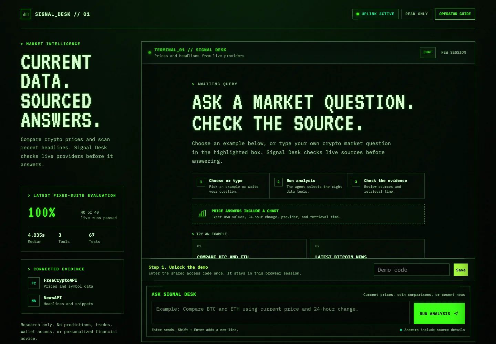

# Signal Desk

A read-only LangGraph agent that checks current cryptocurrency data and recent coverage before answering market-research questions.

[Open the live interface](https://crypto-analysis-agent-langgraph.vercel.app/) · [Review the evaluation](docs/evaluation-report.md) · [See the architecture](docs/architecture.md) · [Run the composite analyst scenario](docs/customer-simulation.md)



Crypto answers go stale quickly. A fluent model response is not enough when a user needs current prices, relevant headlines, and a clear line back to the source. Signal Desk turns each question into a bounded research run: LangGraph selects from three narrow tools, typed clients retrieve live provider data, and the final answer carries sources and retrieval times. Follow-up questions retain limited context without giving the agent access to wallets, exchanges, or transactions.

The same 20-case evaluation ran twice across market data, symbol checks, news, synthesis, threaded follow-ups, and safety. After three response-contract failures were converted into regression coverage, all 40 repeated runs passed. Median response time was 4.835 seconds and estimated OpenAI model cost was $0.022025 for the recorded baseline. The offline suite currently reports 67 passing tests and two opt-in live tests.

| What is shipped | Evidence |
| --- | --- |
| Browser research interface | [Live Vercel deployment](https://crypto-analysis-agent-langgraph.vercel.app/) |
| Bounded model-to-tool workflow | [Architecture and runtime boundaries](docs/architecture.md) |
| Repeatable behavior checks | [20 cases, two runs each](docs/evaluation-report.md) |
| Recorded machine output | [Baseline results](evals/baseline-results.json) |
| Known limits and next steps | [After-action report](docs/after-action-report.md) |

The result is an evaluated research workflow, not a trading product. It does not predict prices, recommend trades, connect to wallets, or execute transactions.

## Source-grounded analyst scenario

The interface includes a one-click analyst-brief scenario designed from public research-workflow evidence. It is a fictional composite, not a customer, endorsement, user study, or adoption claim. The scenario asks for a short BTC-versus-ETH brief with current figures, recent coverage, source links, retrieval times, and an explicit separation of measured facts from possible explanations. See the [scenario, sources, acceptance criteria, and limits](docs/customer-simulation.md).

## How the agent works

### Why LangGraph

A procedural script follows a path selected in advance by the developer. This agent selects a path based on the user's question:

1. The user submits a question.
2. OpenAI interprets the request.
3. LangGraph checks the requested tool calls.
4. The selected tool retrieves current information.
5. The normalized result returns to the model.
6. The model produces a grounded answer.

The graph limits each turn to six requested tool calls, rejects identical repeated calls, executes tools sequentially, and returns structured provider failures. Greetings and timeless explanations do not require a provider request. These controls make the model's actions observable and bounded.

### Memory is an infrastructure choice

The local terminal and hosted browser use different memory strategies. The terminal stores durable SQLite checkpoints under named thread IDs, so a user can close the process and resume the same research conversation. The hosted browser resends at most 12 visible messages with each request because Vercel's serverless filesystem is not durable. API credentials stay on the server in both cases.

SQLite keeps the local version simple, but it does not provide shared, cross-device persistence. A broader release would replace it with a hosted checkpointer.

### Trust requires visible evidence

Current market claims require fresh tool data. Results identify the provider and retrieval time. Missing provider values remain missing instead of becoming zero. News-based explanations stay labeled as hypotheses unless a source directly establishes causation.

For example, the agent should not claim that institutional demand caused a Bitcoin price movement based on timing alone. It should report the measured movement, cite relevant coverage, and separate sourced facts from interpretation.

### Testing the agent instead of trusting one demo

The evaluation baseline uses a fixed 20-case dataset covering market data, symbol checks, news, multi-tool synthesis, threaded follow-ups, and safety. Each case ran twice against a fresh thread.

- 40 of 40 runs passed: 100% on the fixed evaluation set
- Median response time: 4.835 seconds
- Estimated OpenAI model cost: $0.022025
- Every deterministic check passed in all 40 runs

The first run passed 37 of 40. Two threaded news answers omitted the provider label, and one synthesis answer omitted an explicit causal caveat. Those failures stayed in the record. The graph now adds deterministic provider, retrieval-time, and causal-uncertainty evidence from the current turn's tool results. Regression tests cover the boundary, and the unchanged 40-run suite then passed. This result measures one fixed set. It does not establish production reliability. The full method, failure table, and limits are documented in [the evaluation report](docs/evaluation-report.md).

### What the project demonstrates

- Translating a research workflow into product requirements
- Integrating external data providers through typed clients and tools
- Designing explicit model, safety, and cost boundaries
- Handling provider failures and incomplete values
- Measuring behavior through a repeatable evaluation set
- Shipping a browser interface for non-technical users
- Documenting known limits instead of hiding them

The value is not the number of connected APIs. The value is turning uncertain model behavior into a bounded, measurable research workflow.

The next production steps are historical price charts, durable hosted memory, user authentication, shared rate limits, deployment tracing, and structured analyst feedback. The current release remains a read-only research demonstration. It does not predict prices, recommend trades, access wallets, or execute transactions.

## Architecture target

```text
User question
    ↓
LangGraph model node
    ↓ chooses a tool
Coin list | Market data | Crypto news
    ↓
Normalized, timestamped result
    ↓
Grounded answer with uncertainty
```

## Required accounts

1. OpenAI API
   - Create an API key at <https://platform.openai.com/settings/organization/api-keys>.
   - Add a small API credit balance and set a usage limit.
2. FreeCryptoAPI
   - Register at <https://freecryptoapi.com/panel/register.php>.
   - Verify the email address, sign in, and copy the API key from the dashboard.
3. NewsAPI
   - Register at <https://newsapi.org/register> as an individual for this local course project.
   - Verify the email address if requested, sign in, and copy the developer API key.

Do not paste keys into chat, source files, screenshots, tests, or Git.

## Local secret setup

Copy `.env.example` to `.env`, then enter the three keys in `.env` on your computer. The repository ignores `.env`.

```bash
cp .env.example .env
```

Expected private file:

```dotenv
OPENAI_API_KEY=your_openai_key
FREECRYPTO_API_KEY=your_freecrypto_key
NEWS_API_KEY=your_newsapi_key
DEMO_ACCESS_CODE=your_demo_code
ADMIN_ACCESS_CODE=your_separate_admin_code
```

## Development setup

Install `uv`, then run:

```bash
uv python install 3.11
uv sync --extra dev
uv run crypto-agent check-config
```

The configuration command reports whether each service is configured. It never prints a credential.

## Verification

```bash
uv run python -c "import langgraph"
uv run ruff check .
uv run ruff format --check .
uv run --extra dev python -m pytest
```

Run the two live provider checks only when you intend to consume API quota:

```bash
RUN_LIVE_API_TESTS=1 uv run --extra dev python -m pytest -m live
```

Redacted examples of the two live data-provider response shapes are stored in [docs/provider-samples](docs/provider-samples). They contain no article text, current market values, or credentials.

The normalized client contracts and failure behavior are documented in [docs/api-contracts.md](docs/api-contracts.md).

Implemented LangChain tools:

- `list_cryptocurrencies` verifies supported symbols and returns at most 25 matches.
- `get_crypto_market_data` retrieves current data for one to five symbols.
- `search_crypto_news` retrieves at most ten recent headlines and snippets.

FreeCryptoAPI currently returns blank names for some list records. The list tool treats those names as missing data and does not infer replacements.

Use the stateless debug trace to inspect one model-to-tool turn:

```bash
uv run crypto-agent debug "Compare BTC and ETH using current price and 24-hour change."
```

The debug command makes live OpenAI and provider requests. Use it intentionally.

Start a durable conversation:

```bash
uv run crypto-agent chat
```

The CLI prints the generated thread ID. Keep it if you want to resume after closing the process:

```bash
uv run crypto-agent chat --thread crypto-a1b2c3d4e5f6
```

Inside chat, use `new`, `resume THREAD_ID`, `history`, `help`, or `quit`. Checkpoints live at `.data/crypto-agent.sqlite3` by default. Set `CHECKPOINT_DB_PATH` to choose another local path. The repository ignores `.data/`, but the database contains conversation text and tool results. Do not paste credentials or sensitive personal data into a thread.

## Browser interface

Install the Vercel CLI, then start the web-compatible local runtime:

```bash
vercel dev
```

Open `http://localhost:3000`. The browser sends at most 12 visible history messages with each request. API keys remain server-side. When `DEMO_ACCESS_CODE` is configured, the live endpoint requires the shared code through a request header and keeps it in browser session storage.

The web endpoint also applies input limits, security headers, no-store caching, a six-tool-call graph limit, and a best-effort per-instance request limit. Vercel instances do not share the in-memory request counter, so account-level API spending limits remain required.

### Admin execution trace

The hidden admin route shows the current turn as redacted request, model-tool selection, tool output, and final-response events. An expert interpretation layer separates the probabilistic model plane, deterministic control plane, and external evidence plane. Each run also reports observed routing, provider and timestamp counts, tool-budget use, and trace scope. It does not expose chain-of-thought, system prompts, or credentials.

1. Use the bootstrap admin code stored outside Git in `.data/admin-access-code.txt`, or set `ADMIN_ACCESS_CODE` in the local or Vercel environment to rotate it. The environment value takes precedence. Source contains only a SHA-256 verifier for the high-entropy bootstrap code.
2. Open the browser demo with `?admin=1` appended to the URL.
3. Select `Execution trace` and verify the admin code.
4. Return to `Research chat`, submit a question, then reopen the trace tab.

The public chat does not display or call this route. Admin requests use `/api/admin/chat`; standard requests continue through `/api/chat`. The server recursively redacts credential-shaped fields and truncates oversized trace values. This is a portfolio observability surface, not a replacement for production tracing, identity management, or audit-log retention.

## Evaluation baseline

Phase 6 uses a fixed 20-case dataset covering market data, symbol checks, news, multi-tool synthesis, threaded follow-ups, and safety. Every case runs twice against fresh threads.

```bash
uv run crypto-agent evaluate --live --repetitions 2
```

The `--live` flag is required because the command consumes OpenAI tokens and provider quota. The initial August 12, 2026 baseline passed 37 of 40 runs. After converting the three response-contract misses into regression coverage and enforcing evidence at the graph boundary, the unchanged suite passed 40 of 40 runs on August 13. Median latency was 4.835 seconds, and estimated OpenAI model cost was $0.022025.

See [docs/evaluation-report.md](docs/evaluation-report.md) for the methodology, regression analysis, and limits. The full machine-readable run is [evals/baseline-results.json](evals/baseline-results.json).

## How to demo and share it

For a visual demo, open the hosted browser interface or run `vercel dev`. Ask for a BTC and ETH comparison, ask which changed more, and test the safety boundary. Use the CLI when you want to demonstrate durable SQLite restart recovery.

For friends today, screen-share the local CLI or send a short recording. They do not need access to your API keys. Do not send `.env` or the SQLite checkpoint file.

For a public portfolio release, use three layers:

1. A 90-second demo video showing tool choice, a grounded answer, memory, and one safety refusal.
2. A public repository containing architecture, tests, the fixed eval dataset, baseline results, and known failures.
3. A hosted read-only interface with server-side keys and a shared access code. Keep provider spending limits active because application-level throttling is best-effort on serverless instances.

The repository remains private until the Phase 8 secret scan and public-release review. See [docs/showcase-plan.md](docs/showcase-plan.md).

The graph allows six requested tool calls per user turn and rejects identical repeated calls. It disables parallel tool calls so traces and quota use remain ordered during the MVP.

## Safety boundaries

- Read-only market research
- No price predictions
- No buy, sell, or allocation recommendations
- No wallet, exchange, or transaction access
- Current claims require tool data, source names, and retrieval timestamps
- News-based explanations must be labeled as hypotheses unless a source directly establishes causation

## Build plan

See [BUILD_PLAN.md](BUILD_PLAN.md) for the architecture, 25-hour schedule, tests, evaluation targets, and safety boundaries.

## Closeout evidence

- [After-action report](docs/after-action-report.md)
- [Interview story bank](docs/interview-story-bank.md)
- [Architecture](docs/architecture.md)
- [Evaluation report](docs/evaluation-report.md)
- [Showcase and recording plan](docs/showcase-plan.md)
- [FDE readiness audit](docs/fde-readiness-audit.md)
