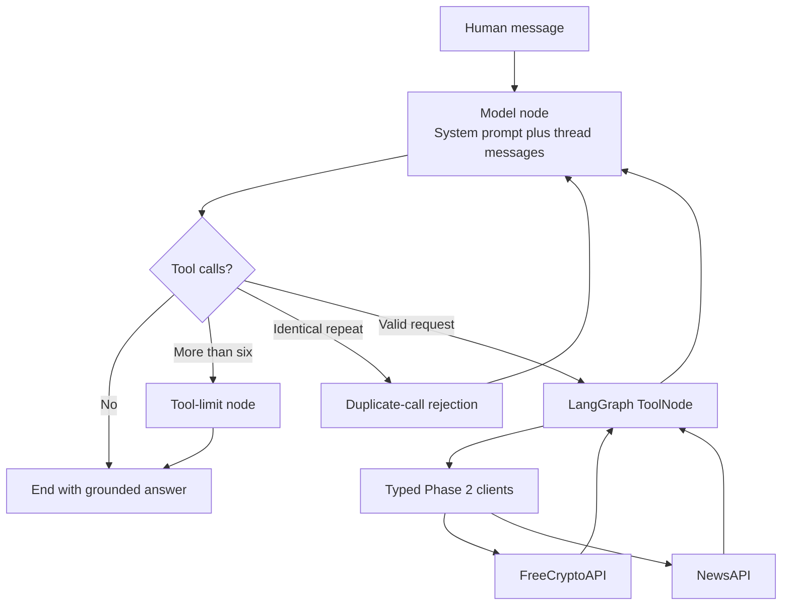

# Phase 4 Architecture

Status: Implemented August 12, 2026

## Requirements

Functional:

- Route current market questions to FreeCryptoAPI market data.
- Route recent-news questions to NewsAPI.
- Route unknown-symbol questions to symbol discovery.
- Return tool results to the model for a grounded answer.
- End without a tool for greetings and timeless explanations.

Non-functional:

- Keep API keys outside graph messages and traces.
- Limit each user turn to six requested tool calls.
- Reject identical repeated calls before another provider request.
- Keep provider and model retries bounded.
- Make nodes, routes, tool arguments, and failures observable.
- Keep default tests free of OpenAI cost and provider quota use.

## Runtime flow

## Key trade-offs

| Decision | Benefit | Cost |
|---|---|---|
| Explicit `StateGraph` | Visible course-faithful routing | More code than `create_agent` |
| Sequential tools | Ordered traces and predictable quota | Higher multi-source latency |
| Six-call limit | Bounded cost and loops | Complex questions may need narrowing |
| Fake-model default tests | Stable and free routing tests | Live model behavior still needs a small gate |
| No checkpointer in Phase 4 | Isolates routing behavior | No thread resume until Phase 5 |

## Failure handling

- Provider authentication, timeout, quota, empty result, and upstream failures remain structured tool content.
- Invalid tool arguments return through LangGraph's tool error handling.
- A seventh requested call receives matching tool errors and a final limit message.
- A duplicate request receives a synthetic tool error, then returns to the model for explanation.
- Missing provider values remain missing instead of becoming zero.

## Security and cost

- `ChatOpenAI` receives the API key from validated local settings.
- Provider credentials remain inside their HTTP clients.
- The graph stores tool names, arguments, outputs, and messages, never credentials.
- Default tests use fake model messages and mocked HTTP transports.
- Live provider and model checks require intentional commands.

See [ADR-0001](adr/0001-bounded-langgraph-tool-loop.md) for alternatives and consequences.
